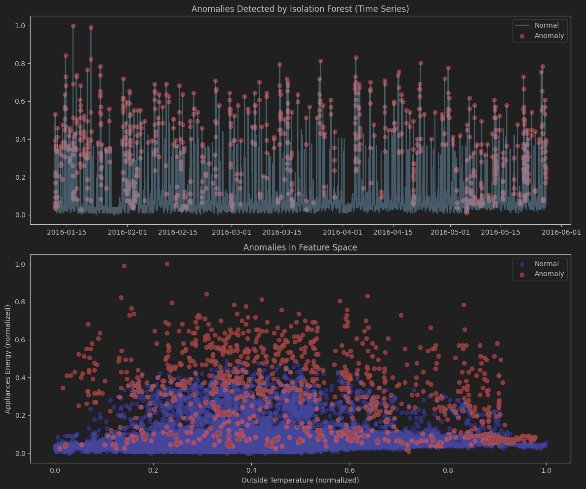
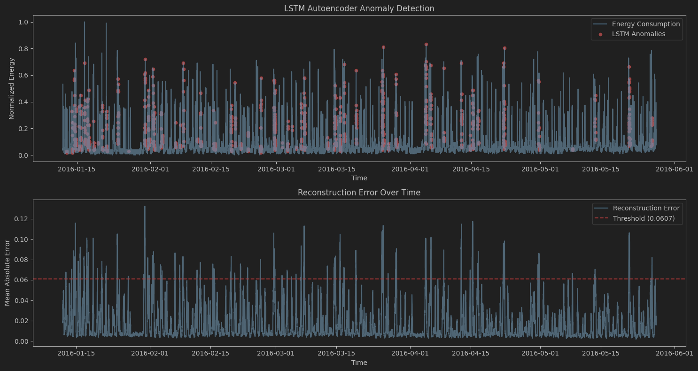

[//]: # (# Energy Consumption Analysis Dataset)

[//]: # (## Yassin Ezaouibi & Hamza El Moukadam & Mohamed Essalhi)

[//]: # ()

[//]: # (## Overview)

[//]: # (This dataset contains measurements of appliance energy consumption along with environmental conditions collected at 10-minute intervals. The data can be used for energy consumption analysis and prediction.)

[//]: # ()

[//]: # (## Data Description)

[//]: # ()

[//]: # (### Time Period)

[//]: # (- Data collected in 10-minute intervals )

[//]: # (- Format: YYYY-MM-DD HH:MM:SS)

[//]: # ()

[//]: # (### Features)

[//]: # (1. **Energy Consumption**)

[//]: # (   - Appliances energy consumption in Wh)

[//]: # (   - Light energy consumption in Wh)

[//]: # ()

[//]: # (2. **Temperature Readings**)

[//]: # (   - T1 to T9: Temperature measurements from different sensors)

[//]: # (   - T_out: Outdoor temperature)

[//]: # ()

[//]: # (3. **Humidity Measurements**)

[//]: # (   - RH_1 to RH_9: Relative humidity from different sensors )

[//]: # (   - RH_out: Outdoor relative humidity)

[//]: # ()

[//]: # (4. **Weather Conditions**)

[//]: # (   - Press_mm_hg: Pressure in mm Hg)

[//]: # (   - Windspeed)

[//]: # (   - Visibility )

[//]: # (   - Tdewpoint: Dew point temperature)

[//]: # ()

[//]: # (5. **Additional Variables**)

[//]: # (   - rv1, rv2: Random variables)

[//]: # ()

[//]: # (## File Format)

[//]: # (- CSV &#40;Comma-Separated Values&#41;)

[//]: # (- Each row represents one time interval)

[//]: # (- Missing values are marked accordingly)

[//]: # ()

[//]: # (## Potential Uses)

[//]: # (- Energy consumption prediction)

[//]: # (- Environmental analysis)

[//]: # (- Building energy efficiency studies)

[//]: # (- Time series analysis)

[//]: # ()

[//]: # (## Data Location)

[//]: # (The dataset is located in the `data` folder of this project.)

[//]: # ()

[//]: # ()

[//]: # ([//]: # &#40;# Anomaly Detection in IoT Energy Data  &#41;)

[//]: # ()

[//]: # ([//]: # &#40;## 🎯 Goal  &#41;)

[//]: # ()

[//]: # ([//]: # &#40;Detect abnormal energy consumption patterns using [UCI Appliances Energy Dataset]&#40;https://archive.ics.uci.edu/dataset/374/appliances+energy+prediction&#41;.  &#41;)

[//]: # ()

[//]: # ([//]: # &#40;&#41;)

[//]: # ()

[//]: # ([//]: # &#40;## 🛠️ Methodology  &#41;)

[//]: # ()

[//]: # ([//]: # &#40;- Data preprocessing &#40;handling missing values, normalization&#41;.  &#41;)

[//]: # ()

[//]: # ([//]: # &#40;- Exploratory Data Analysis &#40;EDA&#41; to visualize trends.  &#41;)

[//]: # ()

[//]: # ([//]: # &#40;- **Isolation Forest** for unsupervised anomaly detection.  &#41;)

[//]: # ()

[//]: # ([//]: # &#40;&#41;)

[//]: # ()

[//]: # ([//]: # &#40;## 📊 Results  &#41;)

[//]: # ()

[//]: # ([//]: # &#40;![Anomalies Plot]&#40;images/anomalies_plot.png&#41;  &#41;)
[//]: # ()

[//]: # ([//]: # &#40;&#41;)
[//]: # ()

[//]: # ([//]: # &#40;## 🚀 Future Work  &#41;)
[//]: # ()

[//]: # ([//]: # &#40;- Real-time detection with `River`.  &#41;)

[//]: # ()

[//]: # ([//]: # &#40;- LSTM Autoencoder for temporal patterns.  &#41;)

# Energy Consumption Anomaly Detection

## Overview

This project focuses on detecting unusual energy consumption patterns using a household energy dataset. By leveraging
machine learning and deep learning techniques, the aim is to identify anomalies that could indicate equipment
malfunctions, inefficient usage, or other significant events.

## 🎯 Goal

The primary objective is to build robust anomaly detection models capable of identifying abnormal energy consumption
patterns in time-series data. This enables proactive insights into potential issues and aids in energy efficiency
analysis.

## Dataset

### Source

This project utilizes
the [UCI Appliances Energy Dataset](https://archive.ics.uci.edu/dataset/374/appliances+energy+prediction), which
provides detailed measurements of appliance energy consumption alongside environmental conditions.

### Data Description

- **Time Period**: Data collected in 10-minute intervals.
- **Format**: YYYY-MM-DD HH:MM:SS

### Features

1. **Energy Consumption**:
    * `Appliances`: Energy consumption of major appliances in Wh.
    * `lights`: Energy consumption of lights in Wh.

2. **Temperature Readings**:
    * `T1` to `T9`: Temperature measurements from various indoor sensors.
    * `T_out`: Outdoor temperature.

3. **Humidity Measurements**:
    * `RH_1` to `RH_9`: Relative humidity from various indoor sensors.
    * `RH_out`: Outdoor relative humidity.

4. **Weather Conditions**:
    * `Press_mm_hg`: Pressure in mm Hg.
    * `Windspeed`: Wind speed.
    * `Visibility`: Visibility.
    * `Tdewpoint`: Dew point temperature.

5. **Additional Variables**:
    * `rv1`, `rv2`: Random variables (used for testing purposes).

### File Format

- CSV (Comma-Separated Values).
- Each row represents one time interval.
- Missing values are handled during preprocessing.

### Data Location

The dataset is expected to be located in the `data/processed_data.csv` file within this project structure.

## 🛠️ Methodology

The anomaly detection process involves several key steps:

1. **Data Preprocessing**:
    * Loading and parsing time-series data.
    * Handling missing values (e.g., using `dropna()`).
    * Scaling numerical features using `MinMaxScaler` to prepare data for distance-based models and neural networks.

2. **Exploratory Data Analysis (EDA)**:
    * Initial visualization of energy consumption trends over time.
    * Analysis of feature distributions to understand data characteristics.

3. **Unsupervised Anomaly Detection Models**:
    * **Isolation Forest**: An ensemble tree-based model used for isolating anomalies. It works by randomly selecting a
      feature and then randomly selecting a split value between the maximum and minimum values of the selected feature.
      Repeatedly, this partitioning effectively isolates anomalies closer to the root of the tree.
    * **LSTM Autoencoder**: A deep learning model that learns a compressed representation of normal time-series
      patterns. Anomalies are identified by high reconstruction errors, where the autoencoder struggles to reconstruct
      unusual sequences.

4. **In-depth Anomaly Analysis**:
    * Quantification of detected anomalies (count and percentage).
    * Temporal analysis of anomalies (hourly and daily patterns).
    * Comparison of feature distributions between normal and anomalous data points to understand characteristics of
      anomalous behavior.
    * **K-Means Clustering on Anomalies**: Applying clustering to the detected anomalies to identify distinct types or
      groups of anomalous events, providing further actionable insights.

## 📊 Results

The project generates various visualizations and statistics to illustrate the detected anomalies and their
characteristics. Key outputs include:

* Time-series plots highlighting anomalous periods.
* Scatter plots showing anomalies in feature space.
* Histograms comparing feature distributions between normal and anomalous data.
* Bar charts illustrating hourly and daily anomaly rates.
* Elbow curves and cluster visualizations for anomaly clustering.

Example of detected anomalies:



Example of LSTM Autoencoder anomaly detection:



## Project Structure

├── data/
│ └── processed_data.csv # Preprocessed energy consumption dataset
├── images/
│ └── *.png # Generated plots and visualizations
├── notebooks/
│ └── ipynb # Main Jupyter Notebook for anomaly detection
├── scripts/
│ └── app.py # Streamlit application for interactive visualization
├── requirements.txt # Project dependencies
└── README.md # Project overview and documentation

## How to Run

To set up and run this project:

1. **Clone the repository**:
   ```bash
   git clone https://github.com/YassinEzaouibi/Energy-Consumption-Anomaly-Detection
   cd Energy-Consumption-Anomaly-Detection
   ```
2. **Create and activate a virtual environment**:
   ```bash
   virtualenv venv
   source venv/bin/activate  # On Windows: `venv\Scripts\activate`
   ```
3. **Install dependencies**:
   ```bash
   pip install -r requirements.txt
   ```
4. **Run the Jupyter Notebook**:
   To execute the anomaly detection and analysis:
   ```bash
   jupyter notebook appliances_anomaly_detection.ipynb
   ```
   The notebook will regenerate images in the `images/` directory only if `processed_data.csv` has changed since the
   last run.

5. **(Optional) Run the Streamlit application**:
   If `app.py` is part of your project, you can run it using:
   ```bash
   streamlit run app.py
   ```

## Requirements

The project dependencies are listed in `requirements.txt`:

* `pandas~=2.2.2`
* `matplotlib~=3.9.2`
* `numpy~=2.1.1`
* `scikit-learn~=1.5.1`
* `statsmodels~=0.14.4`
* `streamlit~=1.45.1` (if using `app.py`)
* `tensorflow~=2.19.0`

## 🚀 Future Work

Potential enhancements and future directions for this project include:

* **Real-time Detection**: Integrating with frameworks like `River` for online anomaly detection as new data arrives.
* **Multivariate LSTM Autoencoder**: Extending the LSTM autoencoder to learn patterns from multiple features
  simultaneously.
* **Explainable AI (XAI)**: Implementing techniques to understand *why* a particular data point was flagged as an
  anomaly.
* **Deployment**: Further development of the Streamlit application (`app.py`) for a more interactive and comprehensive
  anomaly monitoring dashboard.
* **Hyperparameter Tuning**: More rigorous tuning of model hyperparameters for optimal performance.
